# KooAI Architecture Documentation

Comprehensive architecture documentation for the KooAI simulation analysis platform.

## Table of Contents

- [System Overview](#system-overview)
- [Architecture Principles](#architecture-principles)
- [Component Architecture](#component-architecture)
- [Data Flow](#data-flow)
- [Database Architecture](#database-architecture)
- [API Architecture](#api-architecture)
- [Authentication & Authorization](#authentication--authorization)
- [File Processing Architecture](#file-processing-architecture)
- [LLM Integration](#llm-integration)
- [Real-time Communication](#real-time-communication)
- [Deployment Architecture](#deployment-architecture)
- [Technology Stack](#technology-stack)

---

## System Overview

KooAI is a cloud-based platform for analyzing computational fluid dynamics (CFD) and other simulation data using large language models (LLMs).

### High-Level Architecture

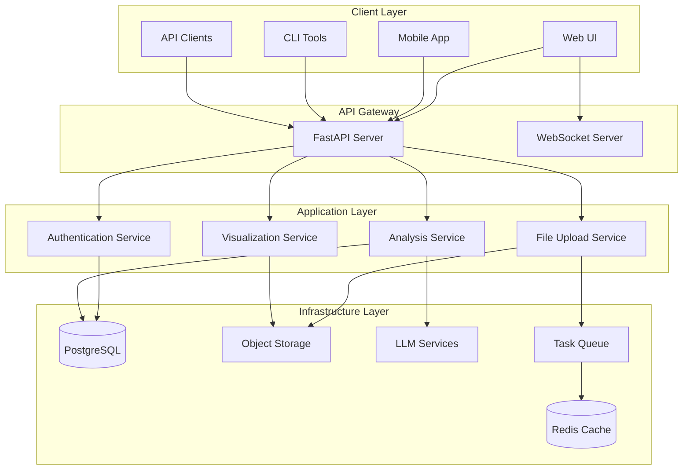

### System Capabilities

1. **File Upload & Processing**: Handle large simulation files with streaming upload
2. **LLM-Powered Analysis**: Analyze simulation data using GPT-4, Claude, etc.
3. **3D Visualization**: Render 3D visualizations and generate charts
4. **Real-time Updates**: WebSocket-based progress tracking
5. **User Management**: JWT-based authentication with RBAC
6. **API-First Design**: RESTful API with OpenAPI documentation

---

## Architecture Principles

### 1. Clean Architecture

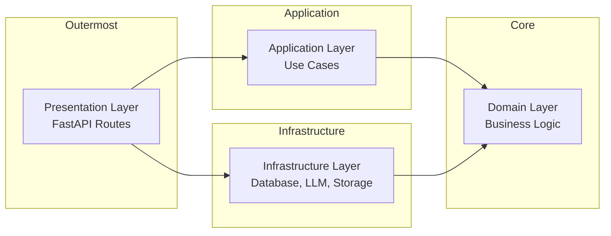

**Key Principles:**
- **Dependency Inversion**: Inner layers don't depend on outer layers
- **Separation of Concerns**: Each layer has a single responsibility
- **Testability**: Business logic isolated from infrastructure
- **Flexibility**: Easy to swap implementations

### 2. Domain-Driven Design

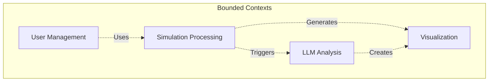

### 3. Microservices-Ready

While currently monolithic, the architecture is designed for future microservices migration:

- **Bounded Contexts**: Clear service boundaries
- **Event-Driven**: Async task processing via queues
- **API Gateway Pattern**: Centralized API entry point
- **Service Independence**: Minimal coupling between domains

---

## Component Architecture

### Layered Architecture

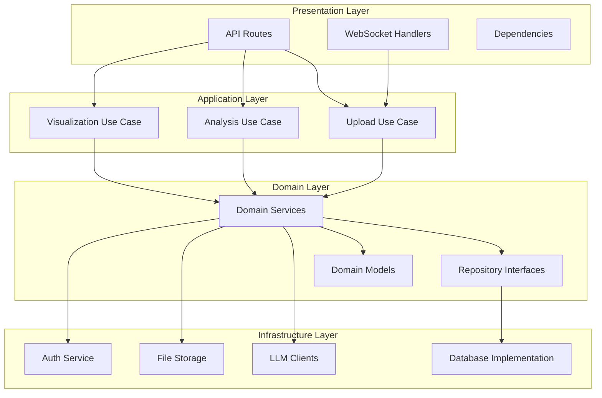

### Component Responsibilities

| Layer | Components | Responsibility |
|-------|-----------|----------------|
| **Presentation** | FastAPI routes, WebSocket | HTTP/WebSocket handling, request validation |
| **Application** | Use cases, orchestrators | Business workflow orchestration |
| **Domain** | Models, services, repositories | Core business logic and rules |
| **Infrastructure** | Database, LLM, storage, auth | External service integration |

---

## Data Flow

### File Upload and Analysis Flow

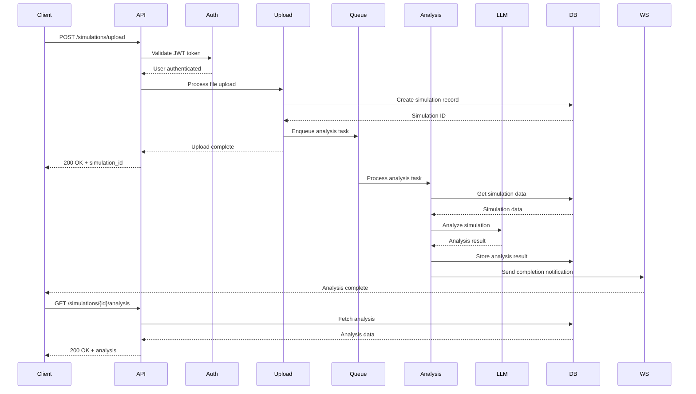

### Streaming LLM Analysis Flow

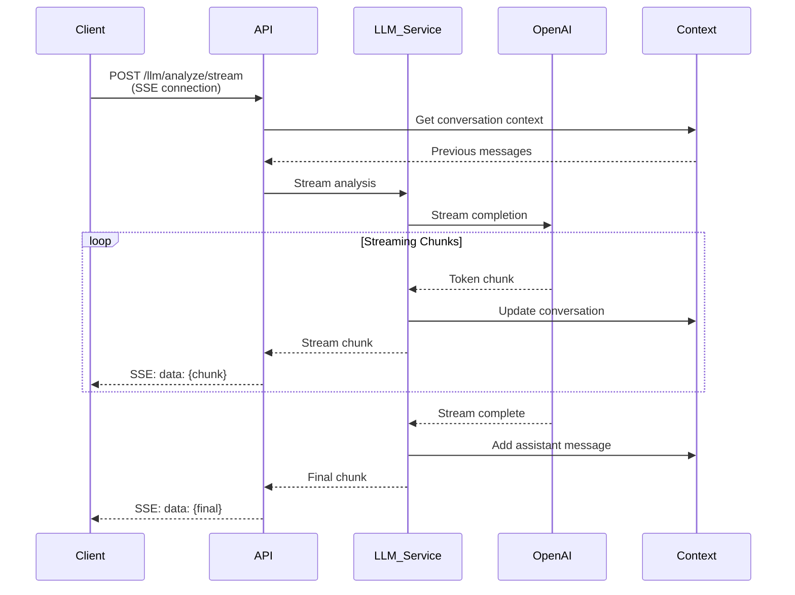

### WebSocket Real-time Updates Flow

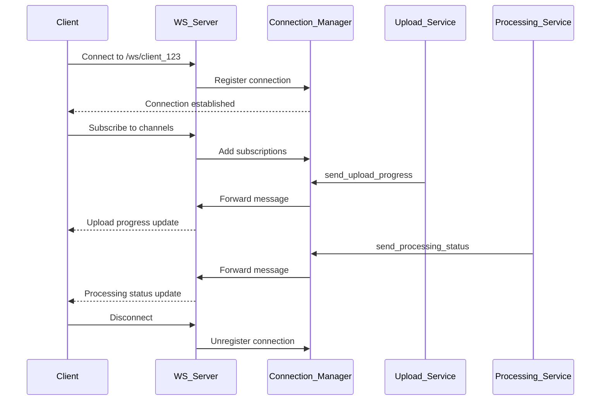

---

## Database Architecture

### Entity-Relationship Diagram

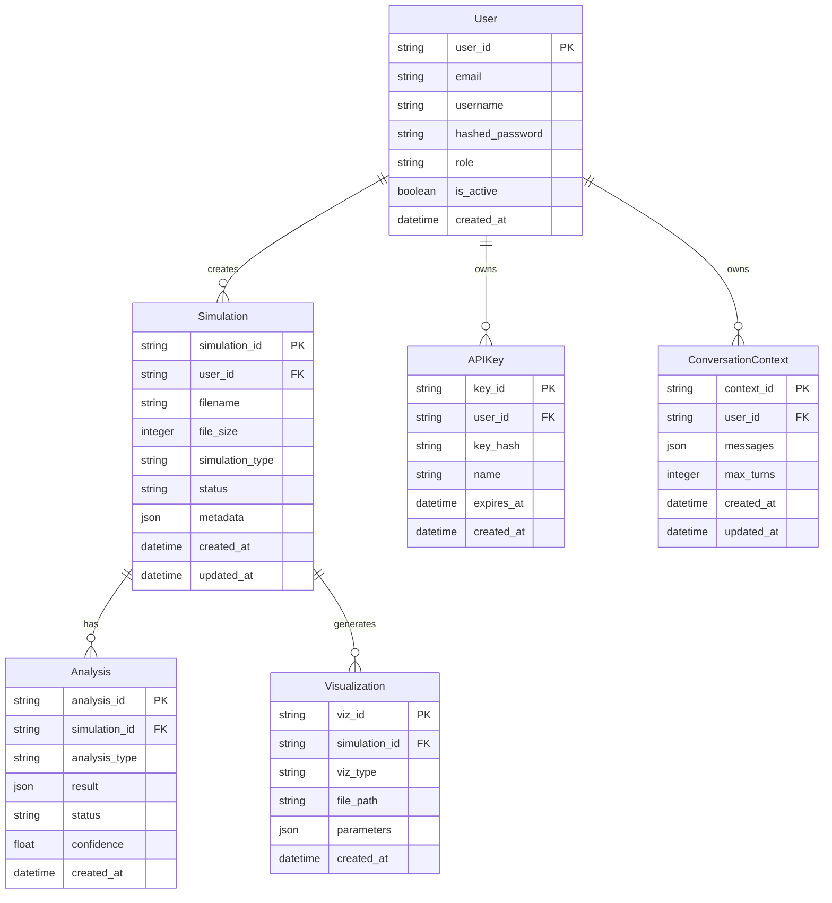

### Database Schema Design Principles

1. **Normalization**: Third normal form (3NF) for transactional data
2. **JSON Columns**: For flexible metadata and results
3. **Timestamps**: Track creation and modification times
4. **Soft Deletes**: Use `deleted_at` for audit trail
5. **Indexes**: On foreign keys and frequently queried columns

### Key Tables

#### Users Table
```sql
CREATE TABLE users (
    user_id VARCHAR(255) PRIMARY KEY,
    email VARCHAR(255) UNIQUE NOT NULL,
    username VARCHAR(255) UNIQUE NOT NULL,
    hashed_password VARCHAR(255) NOT NULL,
    role VARCHAR(50) NOT NULL DEFAULT 'user',
    is_active BOOLEAN DEFAULT TRUE,
    created_at TIMESTAMP DEFAULT CURRENT_TIMESTAMP,
    updated_at TIMESTAMP DEFAULT CURRENT_TIMESTAMP
);

CREATE INDEX idx_users_email ON users(email);
CREATE INDEX idx_users_username ON users(username);
```

#### Simulations Table
```sql
CREATE TABLE simulations (
    simulation_id VARCHAR(255) PRIMARY KEY,
    user_id VARCHAR(255) REFERENCES users(user_id),
    filename VARCHAR(500) NOT NULL,
    file_size BIGINT,
    simulation_type VARCHAR(100),
    status VARCHAR(50) DEFAULT 'uploaded',
    metadata JSONB,
    created_at TIMESTAMP DEFAULT CURRENT_TIMESTAMP,
    updated_at TIMESTAMP DEFAULT CURRENT_TIMESTAMP
);

CREATE INDEX idx_simulations_user_id ON simulations(user_id);
CREATE INDEX idx_simulations_status ON simulations(status);
CREATE INDEX idx_simulations_created_at ON simulations(created_at);
```

#### Analyses Table
```sql
CREATE TABLE analyses (
    analysis_id VARCHAR(255) PRIMARY KEY,
    simulation_id VARCHAR(255) REFERENCES simulations(simulation_id),
    analysis_type VARCHAR(100),
    result JSONB,
    status VARCHAR(50) DEFAULT 'pending',
    confidence FLOAT,
    created_at TIMESTAMP DEFAULT CURRENT_TIMESTAMP
);

CREATE INDEX idx_analyses_simulation_id ON analyses(simulation_id);
CREATE INDEX idx_analyses_status ON analyses(status);
```

---

## API Architecture

### RESTful API Design

```mermaid
graph TB
    subgraph "API Endpoints"
        Auth[/auth/*<br/>Authentication]
        Sims[/simulations/*<br/>Simulation Management]
        LLM[/llm/*<br/>LLM Analysis]
        Viz[/visualizations/*<br/>Visualization]
        Files[/files/*<br/>File Operations]
        WS[/ws/*<br/>WebSocket]
    end

    subgraph "Middleware"
        CORS[CORS Middleware]
        RateLimit[Rate Limiting]
        Logging[Request Logging]
        ErrorHandler[Error Handler]
    end

    subgraph "Core"
        FastAPI_App[FastAPI Application]
    end

    Auth --> FastAPI_App
    Sims --> FastAPI_App
    LLM --> FastAPI_App
    Viz --> FastAPI_App
    Files --> FastAPI_App
    WS --> FastAPI_App

    FastAPI_App --> CORS
    FastAPI_App --> RateLimit
    FastAPI_App --> Logging
    FastAPI_App --> ErrorHandler
```

### API Endpoint Structure

| Endpoint Group | Base Path | Purpose |
|----------------|-----------|---------|
| Authentication | `/api/v1/auth` | User registration, login, token management |
| Simulations | `/api/v1/simulations` | Upload, list, analyze simulations |
| LLM | `/api/v1/llm` | Streaming analysis, context management |
| Visualizations | `/api/v1/visualizations` | 3D rendering, chart generation |
| Files | `/api/v1/files` | Streaming upload, batch operations |
| WebSocket | `/api/v1/ws` | Real-time bidirectional communication |

### Request/Response Lifecycle

```mermaid
graph LR
    Request[HTTP Request] --> Middleware1[CORS]
    Middleware1 --> Middleware2[Rate Limit]
    Middleware2 --> Middleware3[Logging]
    Middleware3 --> Router[Route Handler]

    Router --> Validation[Request Validation]
    Validation --> Auth[Authentication]
    Auth --> Authorization[Authorization]
    Authorization --> Handler[Business Logic]

    Handler --> Response[Response Model]
    Response --> Middleware4[Error Handler]
    Middleware4 --> JSON[JSON Response]
    JSON --> Client[HTTP Response]
```

### OpenAPI Specification

The API is fully documented using OpenAPI 3.0:

- **Interactive Docs**: `/docs` (Swagger UI)
- **Alternative Docs**: `/redoc` (ReDoc)
- **OpenAPI JSON**: `/openapi.json`

---

## Authentication & Authorization

### JWT Authentication Flow

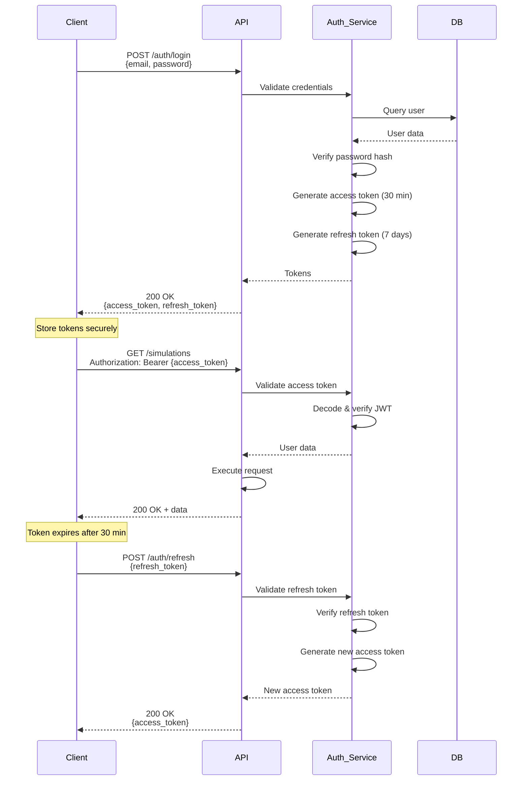

### Role-Based Access Control (RBAC)

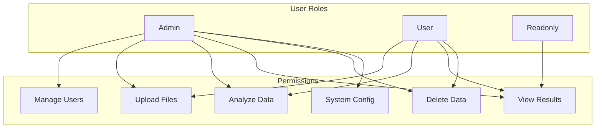

### Token Structure

**Access Token Payload:**
```json
{
  "sub": "usr_abc123",
  "email": "user@example.com",
  "role": "user",
  "type": "access",
  "exp": 1699459200,
  "iat": 1699457400
}
```

**Refresh Token Payload:**
```json
{
  "sub": "usr_abc123",
  "email": "user@example.com",
  "role": "user",
  "type": "refresh",
  "exp": 1700064000,
  "iat": 1699457400
}
```

---

## File Processing Architecture

### Streaming Upload Architecture

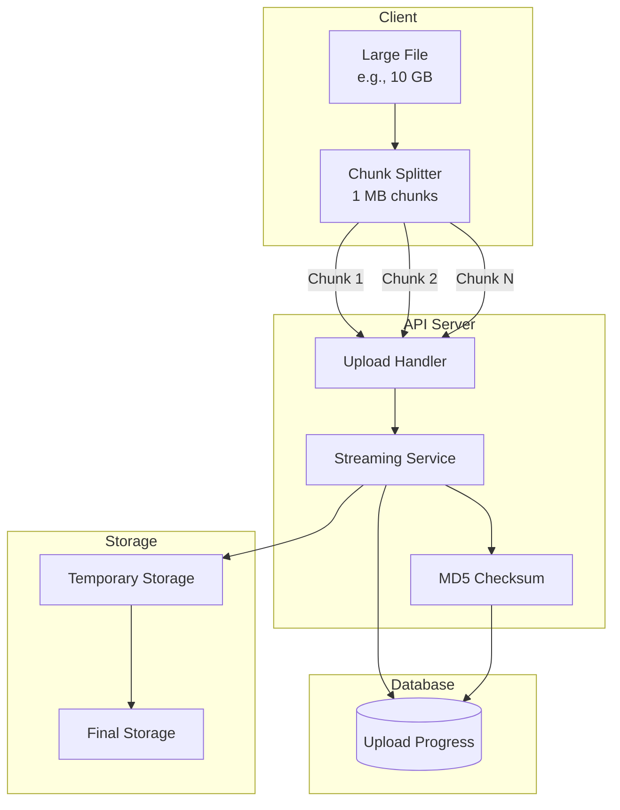

### Parallel File Processing

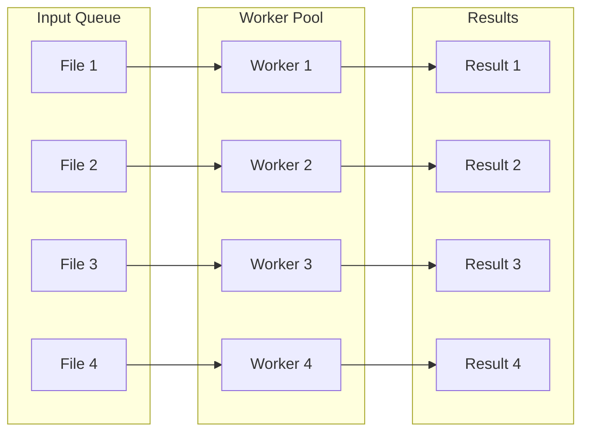

**Features:**
- **Semaphore Control**: Limit concurrent workers (default: 4)
- **Async Processing**: Non-blocking I/O
- **Progress Tracking**: Per-file progress updates
- **Error Handling**: Individual file failures don't block others

---

## LLM Integration

### LLM Service Architecture

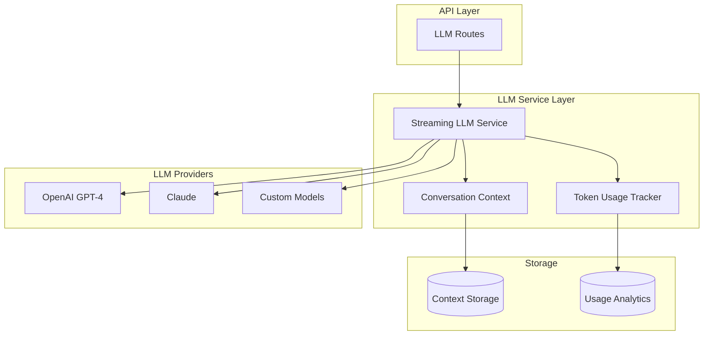

### Conversation Context Management

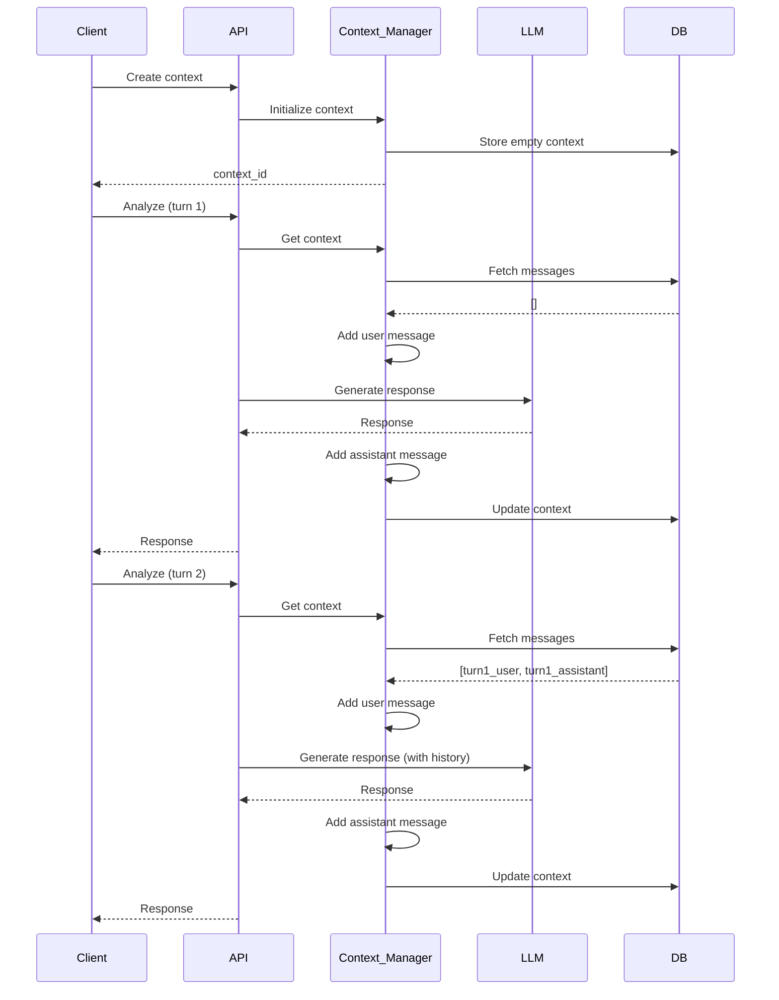

### Token Usage Tracking

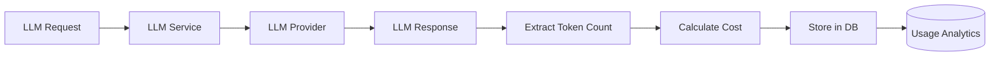

---

## Real-time Communication

### WebSocket Architecture

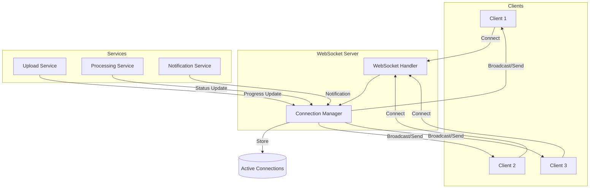

### Message Types

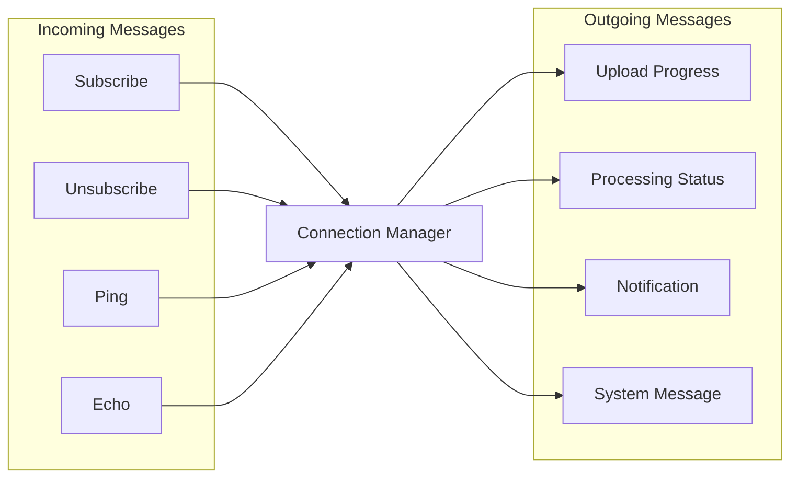

---

## Deployment Architecture

### Production Deployment

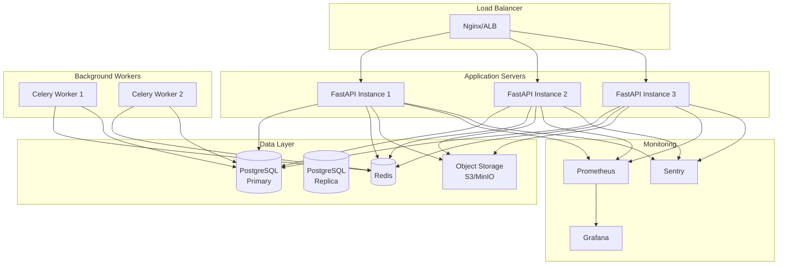

### Container Architecture (Docker)

```mermaid
graph TB
    subgraph "Docker Compose"
        subgraph "Web Container"
            FastAPI[FastAPI App]
            Uvicorn[Uvicorn Server]
        end

        subgraph "Worker Container"
            Celery[Celery Worker]
        end

        subgraph "Database Container"
            PostgreSQL[PostgreSQL 13]
        end

        subgraph "Cache Container"
            Redis_Container[Redis 6]
        end

        subgraph "Proxy Container"
            Nginx[Nginx]
        end
    end

    Nginx --> FastAPI
    FastAPI --> PostgreSQL
    FastAPI --> Redis_Container
    Celery --> Redis_Container
    Celery --> PostgreSQL
```

### Kubernetes Deployment

```mermaid
graph TB
    subgraph "Kubernetes Cluster"
        subgraph "Ingress"
            Ingress[Ingress Controller]
        end

        subgraph "API Deployment"
            API_Pod1[API Pod 1]
            API_Pod2[API Pod 2]
            API_Pod3[API Pod 3]
        end

        subgraph "Worker Deployment"
            Worker_Pod1[Worker Pod 1]
            Worker_Pod2[Worker Pod 2]
        end

        subgraph "Stateful Sets"
            DB_StatefulSet[PostgreSQL StatefulSet]
            Redis_StatefulSet[Redis StatefulSet]
        end

        subgraph "Services"
            API_Service[API Service]
            DB_Service[DB Service]
            Redis_Service[Redis Service]
        end

        subgraph "Storage"
            PVC[Persistent Volume Claims]
        end
    end

    Ingress --> API_Service
    API_Service --> API_Pod1
    API_Service --> API_Pod2
    API_Service --> API_Pod3

    API_Pod1 --> DB_Service
    API_Pod2 --> DB_Service
    API_Pod3 --> DB_Service

    API_Pod1 --> Redis_Service
    Worker_Pod1 --> Redis_Service
    Worker_Pod2 --> Redis_Service

    DB_Service --> DB_StatefulSet
    Redis_Service --> Redis_StatefulSet

    DB_StatefulSet --> PVC
```

---

## Technology Stack

### Backend

| Technology | Purpose | Version |
|------------|---------|---------|
| Python | Primary language | 3.9+ |
| FastAPI | Web framework | 0.104+ |
| Uvicorn | ASGI server | 0.24+ |
| SQLAlchemy | ORM | 2.0+ |
| Alembic | Database migrations | 1.12+ |
| Pydantic | Data validation | 2.5+ |
| Celery | Task queue | 5.3+ |
| Redis | Cache & queue | 6+ |
| PostgreSQL | Database | 13+ |

### AI/ML

| Technology | Purpose |
|------------|---------|
| OpenAI API | GPT-4 integration |
| Anthropic API | Claude integration |
| LangChain | LLM orchestration |

### Visualization

| Technology | Purpose |
|------------|---------|
| PyVista | 3D rendering |
| Matplotlib | Static charts |
| Plotly | Interactive charts |
| VTK | Mesh processing |

### DevOps

| Technology | Purpose |
|------------|---------|
| Docker | Containerization |
| Kubernetes | Orchestration |
| GitHub Actions | CI/CD |
| Prometheus | Monitoring |
| Grafana | Dashboards |
| Sentry | Error tracking |

### Development Tools

| Technology | Purpose |
|------------|---------|
| Poetry | Dependency management |
| Black | Code formatting |
| Ruff | Linting |
| mypy | Type checking |
| pytest | Testing |
| pre-commit | Git hooks |

---

## Security Architecture

### Security Layers

```mermaid
graph TB
    subgraph "Network Security"
        HTTPS[HTTPS/TLS]
        CORS[CORS Policy]
        RateLimit[Rate Limiting]
    end

    subgraph "Application Security"
        JWT[JWT Authentication]
        RBAC[Role-Based Access]
        InputVal[Input Validation]
    end

    subgraph "Data Security"
        Encryption[Data Encryption]
        Hashing[Password Hashing]
        Secrets[Secret Management]
    end

    subgraph "Infrastructure Security"
        Firewall[Firewall Rules]
        VPC[VPC Isolation]
        IAM[IAM Policies]
    end

    HTTPS --> JWT
    CORS --> JWT
    RateLimit --> JWT

    JWT --> InputVal
    RBAC --> InputVal

    InputVal --> Encryption
    Encryption --> Hashing
    Hashing --> Secrets

    Secrets --> Firewall
    Firewall --> VPC
    VPC --> IAM
```

### Security Best Practices

1. **Authentication**: JWT with refresh tokens, bcrypt password hashing
2. **Authorization**: Role-based access control (RBAC)
3. **Data Protection**: HTTPS only, encrypted at rest
4. **Input Validation**: Pydantic models, SQL injection prevention
5. **Rate Limiting**: Prevent abuse, DDoS protection
6. **CORS**: Whitelist allowed origins
7. **Secret Management**: Environment variables, never in code
8. **Audit Logging**: Track all sensitive operations

---

## Performance Considerations

### Optimization Strategies

1. **Database**: Indexes, connection pooling, query optimization
2. **Caching**: Redis for frequently accessed data
3. **Async I/O**: Non-blocking operations with asyncio
4. **Streaming**: Chunked uploads/downloads
5. **Background Tasks**: Offload long-running tasks to Celery
6. **CDN**: Static assets served via CDN
7. **Compression**: Gzip/Brotli response compression

### Scalability

```mermaid
graph LR
    subgraph "Horizontal Scaling"
        API_1[API Server 1]
        API_2[API Server 2]
        API_N[API Server N]
    end

    subgraph "Vertical Scaling"
        CPU[More CPU]
        Memory[More Memory]
        Storage[More Storage]
    end

    LB[Load Balancer] --> API_1
    LB --> API_2
    LB --> API_N

    API_1 -.-> CPU
    API_1 -.-> Memory
    API_1 -.-> Storage
```

---

## Future Architecture Enhancements

### Planned Improvements

1. **Microservices Migration**
   - Split into independent services
   - Service mesh (Istio)
   - Event-driven architecture

2. **Multi-region Deployment**
   - Global load balancing
   - Data replication
   - Edge computing

3. **GraphQL API**
   - Alternative to REST
   - Flexible querying
   - Real-time subscriptions

4. **Machine Learning Pipelines**
   - Model training infrastructure
   - Feature store
   - Model serving

5. **Advanced Caching**
   - Distributed caching
   - Cache invalidation strategies
   - Content delivery network

---

## References

- [FastAPI Documentation](https://fastapi.tiangolo.com/)
- [Clean Architecture](https://blog.cleancoder.com/uncle-bob/2012/08/13/the-clean-architecture.html)
- [Domain-Driven Design](https://martinfowler.com/bliki/DomainDrivenDesign.html)
- [The Twelve-Factor App](https://12factor.net/)
- [Microservices Patterns](https://microservices.io/patterns/index.html)

---

**Last Updated**: 2025-11-08
**Version**: 1.0.0
**Maintainers**: KooAI Engineering Team
